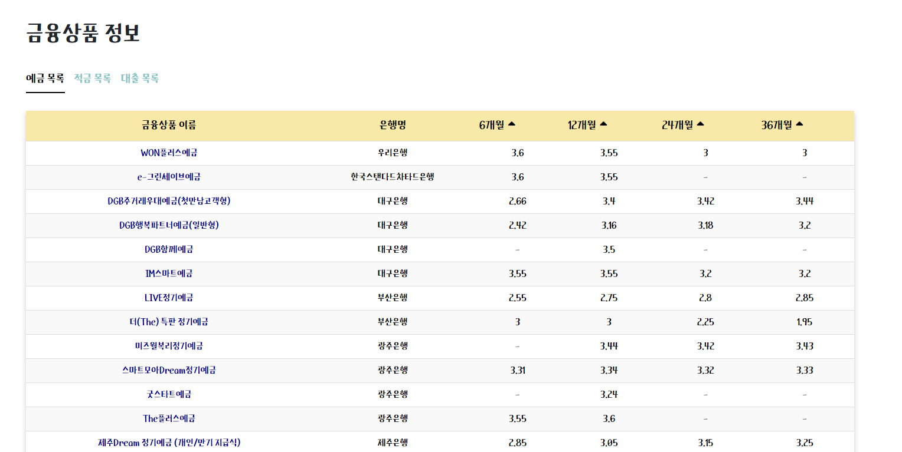
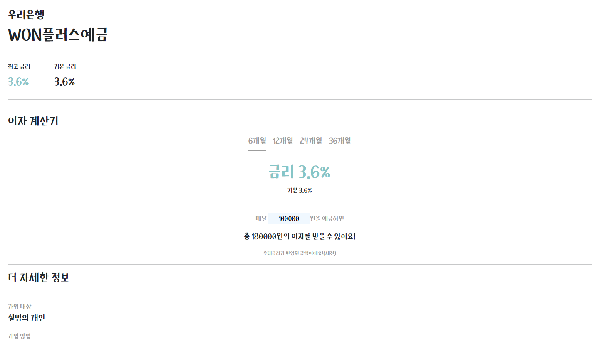
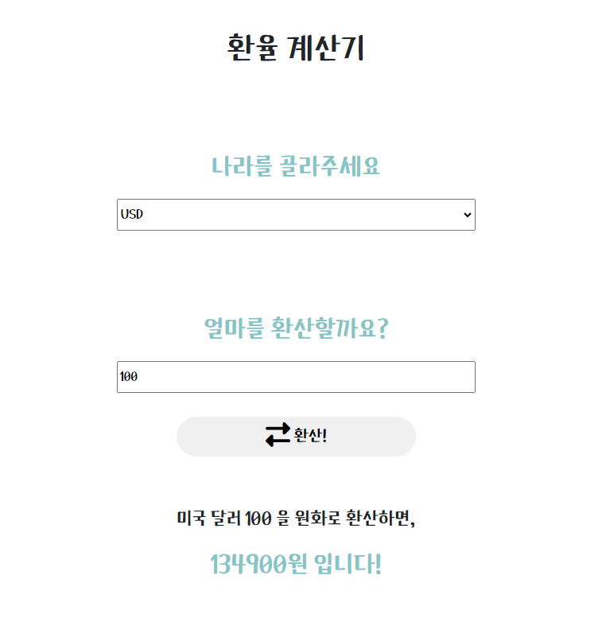
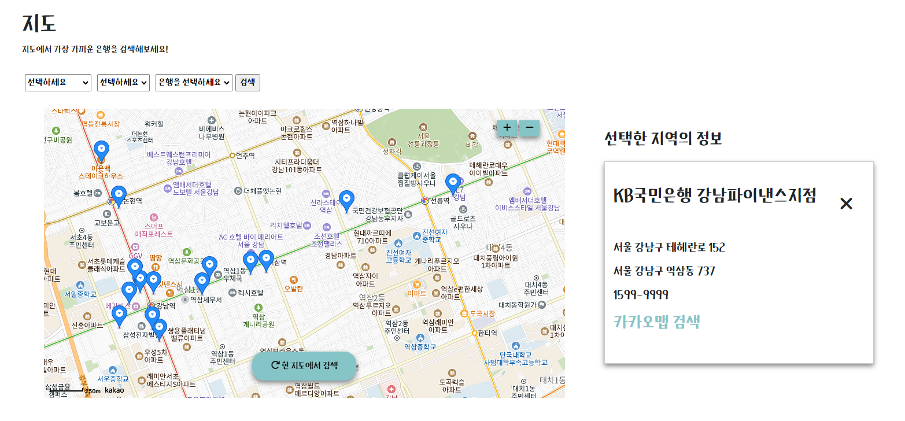
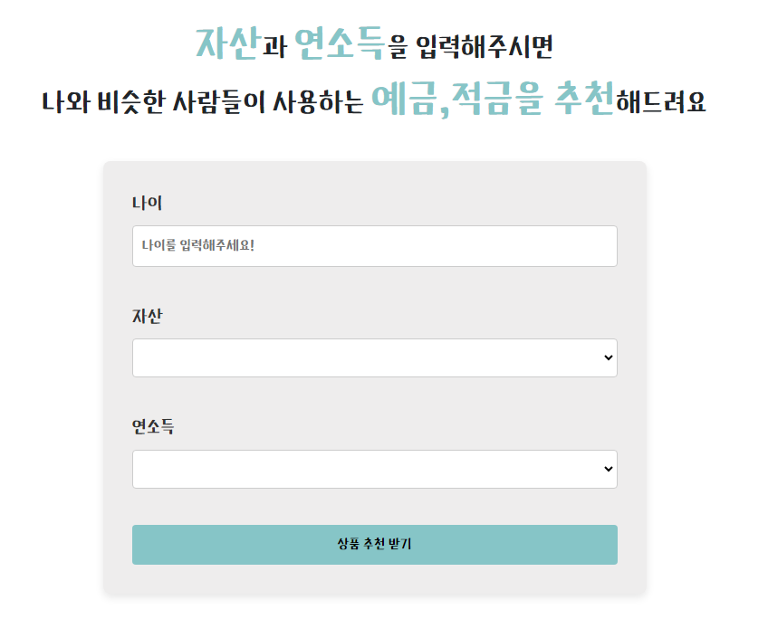

      

    💻삼성 청년 SW 아카데미 관통 프로젝트💻
    금융 상품 통합 비교 및 추천 서비스

## 메인 기능
**1. 금융 상품 비교**   
    예금, 적금, 대출 상품을 한 눈에 확인하고 비교할 수 있습니다.  
       
     

**2. 환율 계산**  
    환율 API가져와서 환율 계산 가능  
     

**3. 지도 보기**  
   지도에서 가장 가까운 은행을 검색할 수 있습니다.  
      
   지도를 옮겨가며 현 지도에서 검색하고, 상세정보를 확인할 수 있습니다.  

**4. 상품 추천**  
    사용자에게 자산과 연소득 정보를 입력받아, 금융 상품을 추천합니다.  
      

## 기술 스택
#### BackEnd

    
    

#### FrontEnd

    
    
    
    

#### 협업

## 팀원

| ||
|:---:|:---:|
| 예지 | 신애 |

## 프로젝트 돌리기
### BackEnd 
(env파일 추가)
`python -m venv venv`
`source venv/Scripts/activate`
`pip install -r requirements.txt`
`python manage.py migrate`
`python manage.py runserver`

### FrontEnd
`npm install`
`npm run dev`